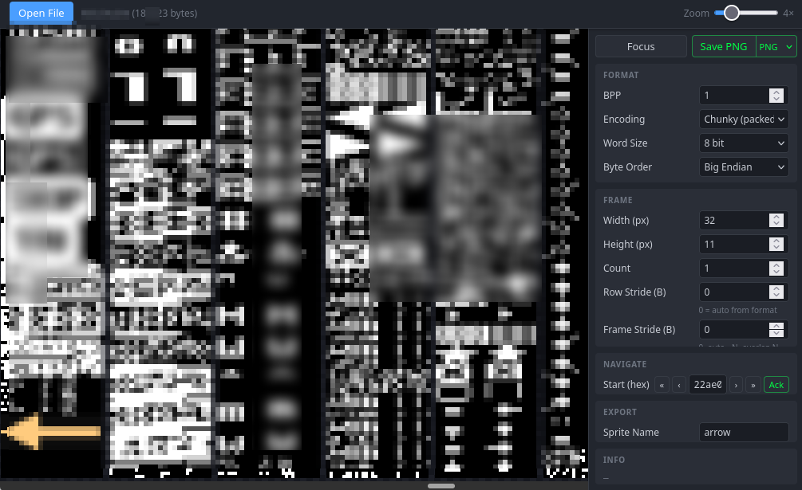

# SpriteRipper

This is an AI-coded simulacrum of [Ripper - A graphics extraction tool](https://keithclark.co.uk/articles/ripper-app/).

I was digging through sprites in a firmware ROM, but either I or the - otherwise excellent - tool from Keith Clark had problems with alignment of sprite frames.

So I yelled my wishes at that AI until I had something that worked.

